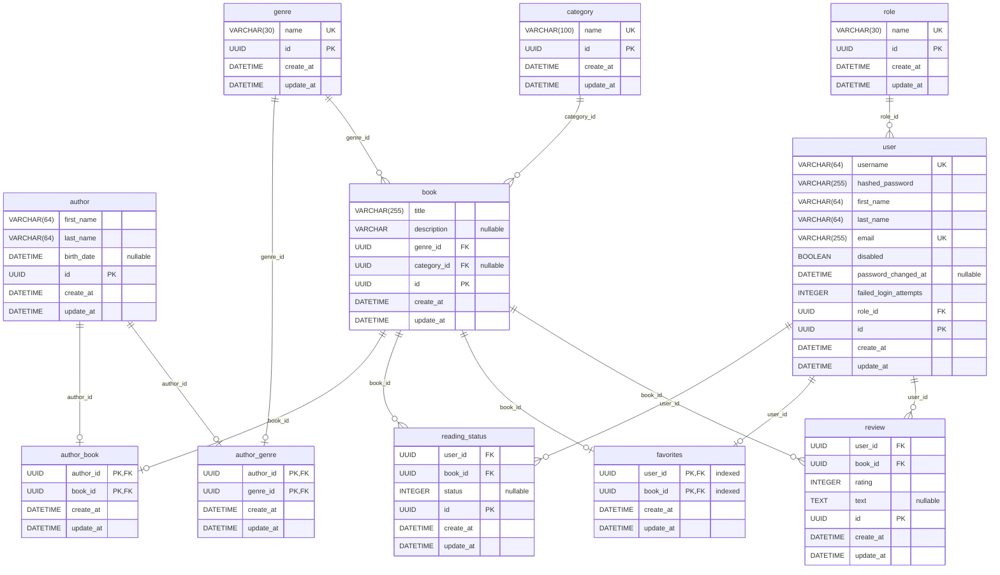

## Команда

| Имя             | Роль                       | Отчет |
|-----------------|----------------------------|-------|
| Егор Калугин    | Тимлид-Разработчик         | Отчет |
| Алина Лукьянова | Тестировщик QA-Разработчик | Отчет |
| Игорь Барбашов  | Аналитик-Разработчик       | [Отчет](./reports/igor_barbashov.md) |
| Денис Еременко  | Разработчик                | Отчет |

### Архитектура проекта

Разработка проекта ведется в соответствии с принципами `Layered Architecture`

### Файловая структура проекта

```
fastapi-project
├── alembic/
├── docs/
├── src
│   ├── api
│   │   └── v1
│   │       └── init.py
│   ├── db
│   │   └ db.py
│   ├── domains
│   │   ├── author
│   │   │   ├── api.py
│   │   │   ├── models.py
│   │   │   ├── repository.py
│   │   │   ├── schema.py
│   │   │   └── services.py
│   │   ├── ...
│   │   └── common
│   │       ├── association
│   │       │   ├── author_genre.py
│   │       │   └── ...
│   │       ├── models.py
│   │       └── schema.py
│   ├── exceptions
│   │   ├── entity.py
│   │   ├── ...
│   │   └── init.py
│   ├── main.py
│   └── setting.py
├── tests
│   ├── author
│   └── ...
├── .env
├── .gitignore
├── .gitlab-ci.yml
├── alembic.ini
├── docker-compose.override.yml
├── docker-compose.yml
├── Dockerfile
├── Makefile
├── poetry.lock
└── pyproject.toml
```

|Папка / Файл|Назначение|
|-|-|
|`/api/v1/init.py`|инициализация всех `API` (подключение роутеров к `app`)|
|`/db/db/py`|инициализация подключения к БД, создание и контроль работы с сессиями БД|
|`/src/<domain_name>`|директория домена|
|`/src/common`|базовые `orm`-модели и доменные схемы, от которых наследуются все остальные|
|`/src/common/association`|содержит файлы для связующих таблиц, реализующих отношения `many-to-many`|
|`tests`|`unit`-тесты|

Каждая `<domain_name>` папка содержит:

|Файл|Назначение|
|-|-|
|`api.py`|контролеры (эндпоинты)|
|`models.py`|`orm`-модели|
|`repository.py`|имплементация работы с БД средствами `ORM`. Должны наследоваться от протокола|
|`schema.py`|доменные модели, `pydantic`-схемы объектов `dto` и `response`|
|`services.py`|бизнес-логика|

## Схема данных



### Соглашение об именовании

- названия доменных моделей, `orm`-моделей, таблиц БД, `pydantic`-схем даются в единственном числе
- названия `orm`-моделей (файлы `models.py`) даются без суффиксов (например `Author`, `User`)
- названия доменных моделей (файлы `schema.py`) даются с суффиксом `Schema` (например `UserSchema`, `UserCreateSchema`)
- названия классов имплиментирующих логику репозиториев (файлы `repository.py`) даются с суффиксом `Repository` и кратким названием БД (например `AuthorRepositoryPG`)
- названия сервисов (файлы `services.py`) даются с суффиксом `Service` (например `AuthorService`, `UserService`)

### Сборка и запуск проекта

Для сборки и запуска используются `make`-команды. Запуск происходит в `Docker`. Одновременно запускаются два контейнера: база данных (`db`) и сервис приложения (`web`).

Если сборка и запуск производятся из Windows, необходимо указать альтернативный скрипт Makefile.win, например: `make -f Makefile.win up-dev`

|Команда|Описание|
|-|-|
|`make build`|cобирает `Docker`-образ сервиса приложения|
|`make up-prod`|запуск в `production`-режиме|
|`make up-dev`|запуск в режиме разработчика|
|`make down`|останавливает и удаляет контейнеры `web`, `db`, также удаляет сети и смонитрованные тома приложения|

### Создание и запуск миграций

Для управления миграциями используется `Alembic`. Все миграции применяются автоматически при старте приложении.

> Важно. Если вы создали новые `orm`-модели, перед созданием миграции необходимо импортировать их в файле `/alembic/env.py`

|Команда|Описание|
|-|-|
|`alembic revision --autogenerate -m "<Name of the migration>"`|Создает файл миграции, регистрирует миграцию в реестре, а также автоматически генерирует код миграции. **Важно**: в автоматически сгенерированную миграцию войдут только изменения схем БД. Для миграции данных, код необходимо написать вручную|
|`alembic revision -m "<Name of the migration>"`|Создает файл миграции, регистрирует миграцию в реестре. Код миграции необходимо написать вручную (функции `upgrade`, `downgrade`)|
|`alembic upgrade head`|Применение миграций|

### Обновление диаграммы данных

paracelsus inject ./README.md

### Контроль качества кода

1. Линтеры, форматтеры
2. Кросс-ревью
3. Тесты
